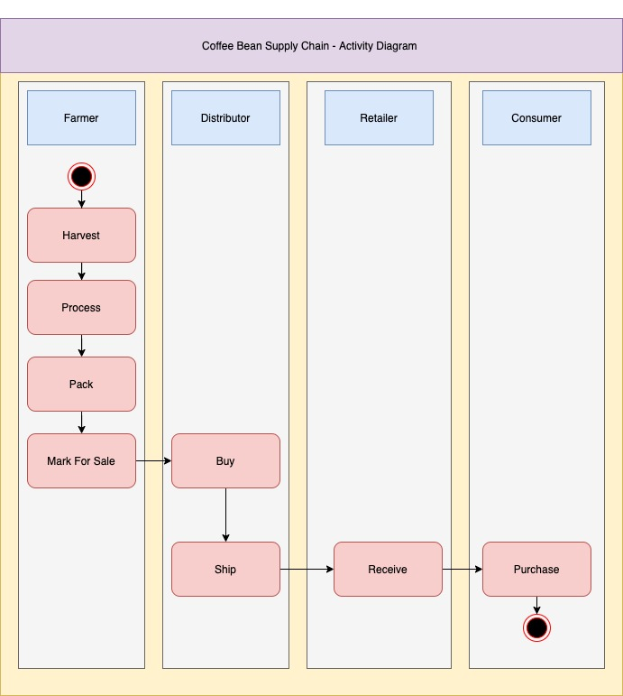
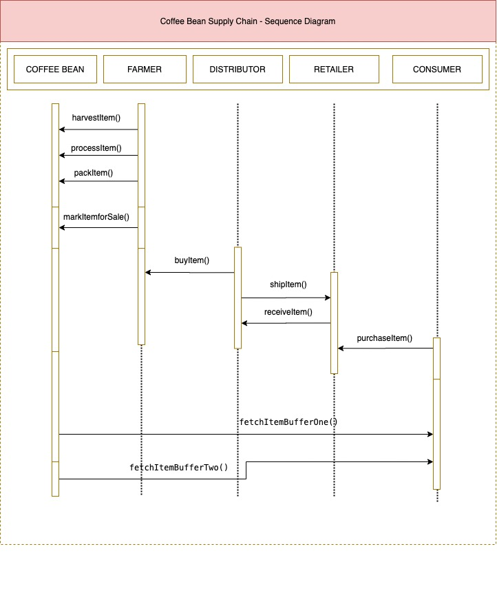
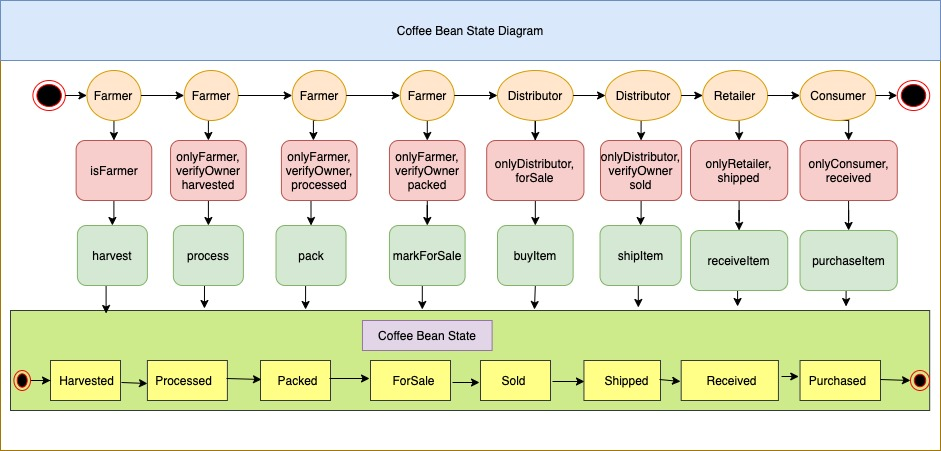
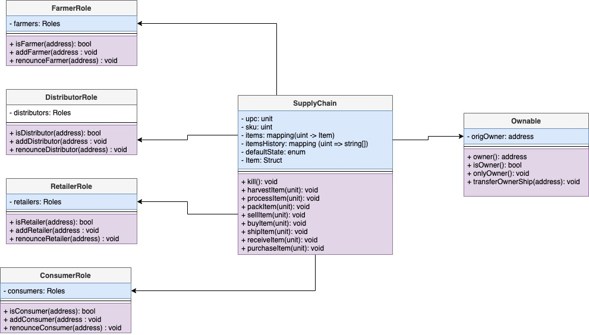
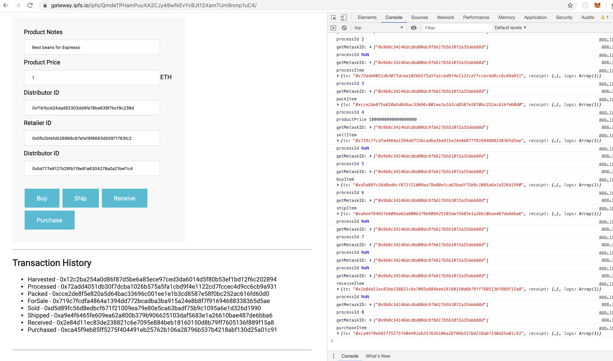

# Coffee Bean Supply Chain Project

## Part 1

### Requirement 1  UML Diagram
#### Activity Diagram

#### Sequence Diagram

#### State Diagram

#### Class Diagram<

### Requirement 2 Libraries

- Roles - Used this library to manage the roles for each type.
- TruffleAssert - Used this to do assertion for watching events emited.
- Truffle v5.1.21 (core: 5.1.21)
- Solidity v0.5.16 (solc-js)
- Node v10.16.0
- Web3.js v1.2.1

### Requirement 3 IPFS

IPFS was used to deploy the Front End code.
https://gateway.ipfs.io/ipfs/QmdeTPHamPuuXA2CJy49wfkEvYvBJt12Xam7Um9nmp1uC4/

Steps Followed
- create a folder dist
- put all the js, css, /build/contracts.json files in the folder
- `ipfs add -r dist`
- `ipfs name publish <hash for dist>`

## Part 2 Write Smart Contracts

All the required Smart Contracts were implemented.

## Part 3 Test Smart Contracts

Tests are being implemented.

## Part 4 - Deploy Smart Contracts

### Contract Address
https://rinkeby.etherscan.io/address/0xbc5d069e60e0066be6d03658764dc757ce3bb0a6

## Part 5 - Modify Client code to interact with smart contract.
I just deployed the client code on IPFS.

https://gateway.ipfs.io/ipfs/QmdeTPHamPuuXA2CJy49wfkEvYvBJt12Xam7Um9nmp1uC4/

